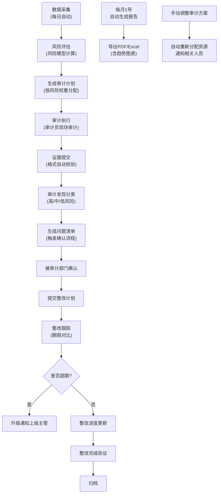

## 1. 产品概述

企业级内部审计管理系统，实现审计全生命周期数字化管理。系统自动采集多业务系统数据，通过风险模型智能评估，生成审计计划并分配资源，支持证据提交、问题发现、整改跟踪全流程管控，自动生成分析报告，提升审计效率与风险管理水平。

- **核心价值**：实现审计工作数字化、智能化、自动化，降低人工成本，提高审计覆盖面和精准度
- **目标用户**：审计部门管理人员、审计员、被审计部门负责人、企业高管

---

## 2. 核心功能

### 2.1 用户角色

| 角色 | 注册方式 | 核心权限 |
|------|----------|----------|
| 系统管理员 | 后台创建 | 系统配置、用户管理、权限分配、日志查询 |
| 审计经理 | 后台创建 | 审计方案管理、风险模型配置、计划审批、报告审核、资源调配 |
| 审计员 | 后台创建 | 执行审计任务、提交证据、记录发现、跟踪整改、导出数据 |
| 被审计部门负责人 | 后台创建 | 确认审计发现、提交整改计划、汇报整改进度 |
| 高管/查看者 | 后台创建 | 查看审计报告、风险仪表盘、统计数据 |

### 2.2 功能模块

1. **仪表盘**：风险概览、审计进度统计、问题发现率、整改完成率、异常预警
2. **审计对象管理**：被审计单位/部门信息维护、风险标签管理
3. **数据采集与风险评估**：多源数据自动抓取、风险模型计算、综合风险分生成
4. **审计计划管理**：年度计划生成、任务分配、资源调度、手动调整
5. **证据管理**：在线提交、格式校验、版本管理、批量导出证据包
6. **审计发现管理**：问题记录、风险分类（高/中/低）、问题清单、确认流程
7. **整改跟踪**：整改计划、期限对比、任务跟踪、超期升级通知
8. **报告中心**：月度自动报告、趋势图表、PDF/Excel导出
9. **系统设置**：风险模型配置、通知模板、审批流程、审计群管理
10. **日志中心**：操作日志、异常预警、全生命周期追溯查询

### 2.3 页面详情

| 页面名称 | 模块名称 | 功能描述 |
|----------|----------|----------|
| 登录页 | 身份认证 | 账号密码登录、验证码、记住登录状态 |
| 仪表盘 | 数据概览 | KPI卡片、风险热力图、趋势折线图、任务进度环形图、预警通知栏 |
| 审计对象列表 | 审计对象管理 | 分页列表、风险等级筛选、搜索、新增/编辑/删除 |
| 审计对象详情 | 审计对象管理 | 基本信息、风险评分历史、关联审计项目、问题清单 |
| 风险评估 | 风险评估引擎 | 风险模型展示、手动触发评估、评估历史记录 |
| 审计计划列表 | 审计计划管理 | 年度计划、状态筛选、批量分配、手动调整 |
| 审计计划详情 | 审计计划管理 | 任务分解、审计员分配、进度跟踪、资源甘特图 |
| 证据上传 | 证据管理 | 拖拽上传、格式校验、进度显示、关联审计对象 |
| 证据列表 | 证据管理 | 文件列表、预览、下载、批量导出证据包 |
| 审计发现列表 | 审计发现管理 | 问题清单、风险标签、筛选查询、状态流转 |
| 审计发现详情 | 审计发现管理 | 问题描述、证据关联、风险定级、被审计部门确认 |
| 整改计划列表 | 整改跟踪 | 整改任务、截止日期、进度百分比、超期预警 |
| 整改计划详情 | 整改跟踪 | 整改措施、责任人、更新记录、效果验证 |
| 报告中心 | 报告生成 | 报告列表、预览、PDF导出、Excel导出、趋势图表 |
| 系统设置 | 系统管理 | 风险权重配置、通知规则、用户管理、角色权限 |
| 操作日志 | 日志中心 | 全量操作记录、筛选查询、导出 |
| 预警中心 | 异常预警 | 实时预警列表、已处理预警、批量标记已读 |

---

## 3. 核心流程

### 3.1 审计全流程

系统每日自动从合同、采购、财务系统抓取数据，通过风险模型计算各审计对象综合风险分，生成年度审计计划并按风险权重分配审计员。审计员现场审计后在线提交证据，系统自动校验格式并关联对象。根据规则自动分类审计发现为高/中/低风险，生成问题清单并触发被审计部门确认。被审计部门提交整改计划后，系统对比期限与效果生成跟踪任务，超期未完成自动升级通知上级。每月1号自动生成内部审计报告，支持导出带趋势图表的PDF和Excel。用户可按多维度组合查询全生命周期记录并批量导出证据包，所有操作记录日志，异常实时推送审计群。

---

## 4. 用户界面设计

### 4.1 设计风格

- **设计基调**：专业严谨、数据驱动的企业级管理系统风格，采用"精制商务"美学
- **主色调**：深蓝 `#1e3a5f`（专业、信任），辅以藏青 `#2c5282`
- **强调色**：高风险红 `#c53030`，中风险橙 `#dd6b20`，低风险绿 `#2f855a`，信息蓝 `#2b6cb0`
- **中性色**：采用 `slate` 色系，从 `slate-50` 到 `slate-900` 构建完整的灰度层次
- **字体**：标题采用 `Noto Serif SC`（商务衬线字体，提升专业感），正文采用 `Inter`（清晰易读的无衬线字体）
- **按钮风格**：直角微圆角（`border-radius: 2px`），扁平化设计，悬停时有微妙的阴影变化
- **布局风格**：左侧导航栏+顶部面包屑+主内容区的经典企业级布局，卡片式内容容器，清晰的视觉层次
- **图标风格**：统一使用 `lucide-react` 线性图标，保持简洁一致的视觉语言

### 4.2 页面设计概述

| 页面名称 | 模块名称 | UI元素 |
|----------|----------|--------|
| 登录页 | 身份认证 | 深蓝渐变背景，居中登录卡片，商务字体标题，精致输入框动画 |
| 仪表盘 | 数据概览 | 4张KPI卡片（风险评分、审计项目、问题发现、整改完成），风险分布饼图，趋势折线图，最近预警列表 |
| 审计对象列表 | 审计对象管理 | 顶部搜索筛选栏，表格列表（风险等级色标），分页器，操作按钮组 |
| 风险评估 | 风险评估引擎 | 风险模型权重配置面板，雷达图展示多维度评分，评估历史时间线 |
| 审计计划列表 | 审计计划管理 | 年度计划时间轴，任务分配甘特图，资源负载热力图 |
| 证据上传 | 证据管理 | 拖拽上传区域，文件预览缩略图，上传进度条，格式校验提示 |
| 审计发现列表 | 审计发现管理 | 风险标签（红/橙/绿三色），问题状态流转指示器，批量操作工具栏 |
| 整改跟踪 | 整改跟踪 | 截止日期倒计时标签，进度条，超期红色高亮，升级通知记录 |
| 报告中心 | 报告生成 | 报告卡片列表，图表预览缩略图，导出格式选择器，时间范围筛选 |
| 系统设置 | 系统管理 | 标签页布局（风险模型/通知规则/用户管理），表单分组，保存按钮固定底部 |
| 操作日志 | 日志中心 | 时间线布局，操作类型筛选，详情抽屉面板 |

### 4.3 响应式设计

- **设计原则**：Desktop-first，优先保障桌面端复杂数据展示的完整性
- **断点设置**：
  - 桌面端：`>= 1280px`，三栏布局（侧边栏+主内容+详情面板）
  - 平板端：`768px - 1279px`，两栏布局，侧边栏可折叠
  - 移动端：`< 768px`，单栏布局，底部导航，表格转卡片展示
- **触摸优化**：移动端按钮最小尺寸 `44px`，关键操作支持下拉刷新和左右滑动

### 4.4 交互动效

- **页面加载**：骨架屏占位，内容渐入（`fadeInUp`，延迟错开）
- **数据更新**：数字滚动动画（KPI变化时），图表平滑过渡
- **表单交互**：输入框聚焦时边框高亮，错误时轻微抖动提示
- **导航切换**：侧边栏折叠/展开有平滑过渡动画
- **状态变化**：风险等级变化时有颜色渐变过渡，任务完成有打勾动画
