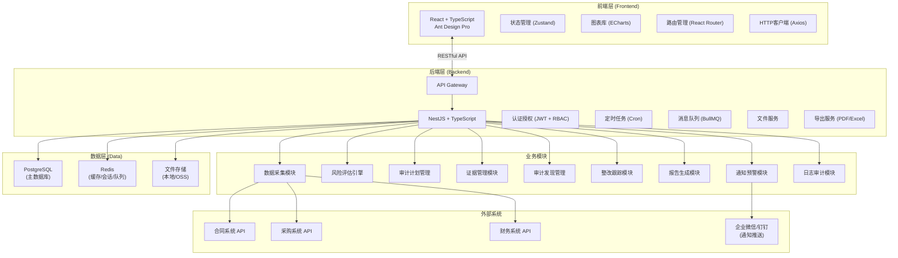
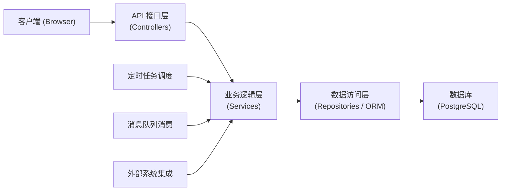
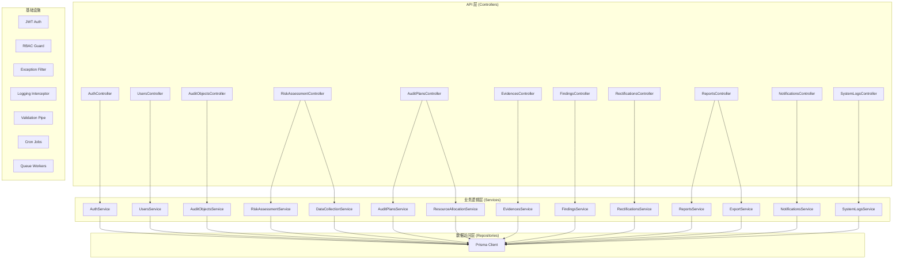
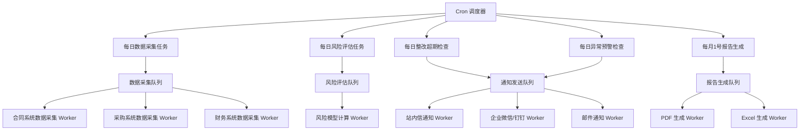
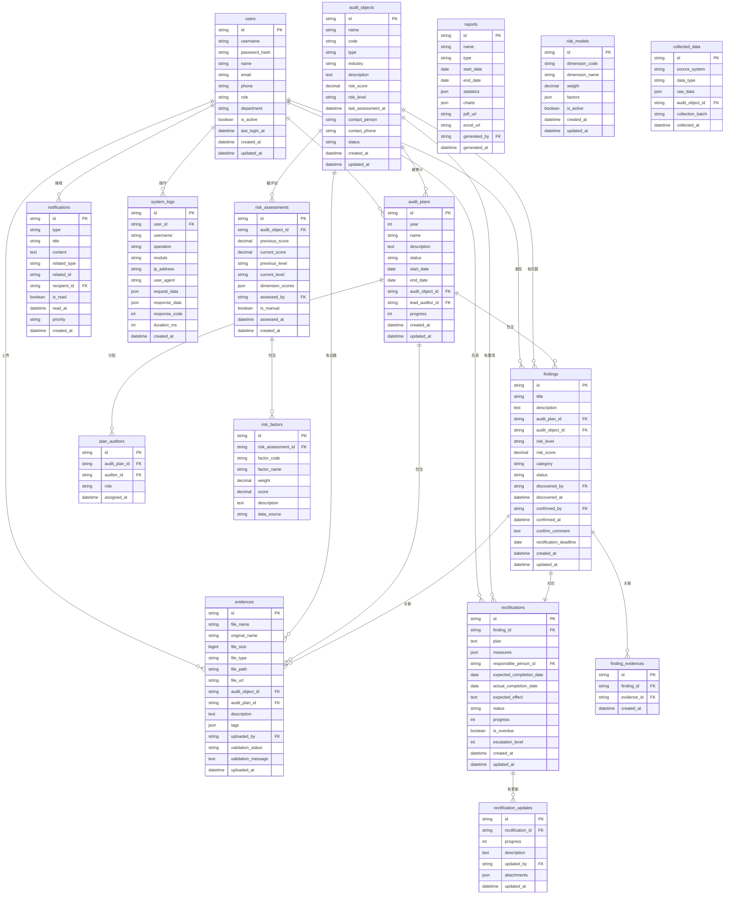

## 1. 架构设计

### 1.1 总体架构



### 1.2 分层架构



---

## 2. 技术描述

### 2.1 技术栈选型

| 层级 | 技术选型 | 版本 | 说明 |
|------|----------|------|------|
| **前端框架** | React | 18.x | 组件化开发，生态成熟 |
| **前端语言** | TypeScript | 5.x | 类型安全，提升可维护性 |
| **前端UI** | Ant Design | 5.x | 企业级组件库，开箱即用 |
| **构建工具** | Vite | 5.x | 极速开发体验，热更新 |
| **状态管理** | Zustand | 4.x | 轻量高效，API简洁 |
| **路由管理** | React Router | 6.x | 声明式路由，嵌套路由 |
| **HTTP客户端** | Axios | 1.x | 请求拦截，响应处理 |
| **图表库** | ECharts | 5.x | 丰富图表类型，大数据量支持 |
| **后端框架** | NestJS | 10.x | 企业级Node.js框架，模块化 |
| **后端语言** | TypeScript | 5.x | 与前端一致的类型系统 |
| **ORM** | Prisma | 5.x | 类型安全的数据库访问 |
| **数据库** | PostgreSQL | 15.x | 功能强大，支持JSON、复杂查询 |
| **缓存** | Redis | 7.x | 会话存储、缓存、消息队列 |
| **消息队列** | BullMQ | 5.x | 基于Redis的任务队列 |
| **任务调度** | node-cron | 3.x | Cron表达式定时任务 |
| **认证** | JWT | 9.x | 无状态认证，跨域支持 |
| **PDF导出** | Puppeteer | 21.x | HTML转PDF，支持图表 |
| **Excel导出** | ExcelJS | 4.x | 高性能Excel生成 |
| **文件上传** | Multer | 1.4.x | Express文件上传中间件 |

### 2.2 项目结构

```
audit-management-system/
├── frontend/                    # 前端应用
│   ├── src/
│   │   ├── components/          # 公共组件
│   │   ├── pages/               # 页面组件
│   │   ├── layouts/             # 布局组件
│   │   ├── stores/              # Zustand状态管理
│   │   ├── hooks/               # 自定义Hooks
│   │   ├── services/            # API服务
│   │   ├── utils/               # 工具函数
│   │   ├── types/               # TypeScript类型定义
│   │   ├── router/              # 路由配置
│   │   ├── assets/              # 静态资源
│   │   ├── App.tsx
│   │   └── main.tsx
│   ├── public/
│   ├── package.json
│   ├── tsconfig.json
│   ├── vite.config.ts
│   └── tailwind.config.js
│
├── backend/                     # 后端应用
│   ├── src/
│   │   ├── common/              # 公共模块
│   │   │   ├── filters/         # 异常过滤器
│   │   │   ├── guards/          # 守卫
│   │   │   ├── interceptors/    # 拦截器
│   │   │   └── pipes/           # 管道
│   │   ├── config/              # 配置模块
│   │   ├── modules/             # 业务模块
│   │   │   ├── auth/            # 认证授权
│   │   │   ├── users/           # 用户管理
│   │   │   ├── audit-objects/   # 审计对象
│   │   │   ├── data-collection/ # 数据采集
│   │   │   ├── risk-assessment/ # 风险评估
│   │   │   ├── audit-plans/     # 审计计划
│   │   │   ├── evidences/       # 证据管理
│   │   │   ├── findings/        # 审计发现
│   │   │   ├── rectifications/  # 整改跟踪
│   │   │   ├── reports/         # 报告生成
│   │   │   ├── notifications/   # 通知预警
│   │   │   └── system-logs/     # 系统日志
│   │   ├── shared/              # 共享模块
│   │   │   ├── prisma/          # Prisma服务
│   │   │   ├── redis/           # Redis服务
│   │   │   ├── queue/           # 消息队列
│   │   │   └── export/          # 导出服务
│   │   ├── jobs/                # 定时任务
│   │   ├── app.module.ts
│   │   └── main.ts
│   ├── prisma/
│   │   ├── schema.prisma        # 数据模型
│   │   └── migrations/          # 数据库迁移
│   ├── uploads/                 # 文件上传目录
│   ├── exports/                 # 导出文件目录
│   ├── package.json
│   ├── tsconfig.json
│   └── nest-cli.json
│
├── docker-compose.yml           # Docker编排
├── .env.example                 # 环境变量示例
└── README.md
```

---

## 3. 路由定义

### 3.1 前端路由

| 路由路径 | 页面名称 | 权限要求 |
|----------|----------|----------|
| `/login` | 登录页 | 公开 |
| `/dashboard` | 仪表盘 | 登录用户 |
| `/audit-objects` | 审计对象列表 | 审计员/经理/管理员 |
| `/audit-objects/:id` | 审计对象详情 | 审计员/经理/管理员 |
| `/risk-assessment` | 风险评估 | 审计经理/管理员 |
| `/audit-plans` | 审计计划列表 | 审计员/经理/管理员 |
| `/audit-plans/:id` | 审计计划详情 | 审计员/经理/管理员 |
| `/evidences` | 证据列表 | 审计员/经理/管理员 |
| `/evidences/upload` | 证据上传 | 审计员 |
| `/findings` | 审计发现列表 | 审计员/经理/管理员 |
| `/findings/:id` | 审计发现详情 | 审计员/经理/管理员 |
| `/rectifications` | 整改计划列表 | 所有登录用户 |
| `/rectifications/:id` | 整改计划详情 | 相关责任人 |
| `/reports` | 报告中心 | 审计经理/管理员/高管 |
| `/settings` | 系统设置 | 系统管理员 |
| `/logs` | 操作日志 | 系统管理员 |
| `/alerts` | 预警中心 | 审计经理/管理员 |

---

## 4. API 定义

### 4.1 通用响应结构

```typescript
interface ApiResponse<T = any> {
  code: number;           // 状态码：0成功，其他错误
  message: string;        // 提示信息
  data: T;                // 响应数据
  timestamp: number;      // 时间戳
}

interface PaginatedResponse<T> {
  items: T[];
  total: number;
  page: number;
  pageSize: number;
  totalPages: number;
}
```

### 4.2 核心API接口

#### 4.2.1 认证接口

```typescript
// POST /api/auth/login
interface LoginRequest {
  username: string;
  password: string;
  captcha?: string;
}

interface LoginResponse {
  accessToken: string;
  refreshToken: string;
  user: {
    id: string;
    username: string;
    name: string;
    role: string;
    permissions: string[];
  };
}

// POST /api/auth/refresh-token
interface RefreshTokenRequest {
  refreshToken: string;
}

// POST /api/auth/logout
```

#### 4.2.2 审计对象接口

```typescript
// GET /api/audit-objects
interface GetAuditObjectsQuery {
  page?: number;
  pageSize?: number;
  keyword?: string;
  riskLevel?: 'high' | 'medium' | 'low';
  industry?: string;
  status?: 'active' | 'inactive';
}

interface AuditObject {
  id: string;
  name: string;
  code: string;
  type: string;
  industry: string;
  description: string;
  riskLevel: 'high' | 'medium' | 'low';
  riskScore: number;
  lastAssessmentDate: string;
  contactPerson: string;
  contactPhone: string;
  status: 'active' | 'inactive';
  createdAt: string;
  updatedAt: string;
}

// POST /api/audit-objects
interface CreateAuditObjectRequest {
  name: string;
  code: string;
  type: string;
  industry: string;
  description: string;
  contactPerson: string;
  contactPhone: string;
}

// PUT /api/audit-objects/:id
type UpdateAuditObjectRequest = Partial<CreateAuditObjectRequest> & {
  status?: 'active' | 'inactive';
};

// DELETE /api/audit-objects/:id
// GET /api/audit-objects/:id
```

#### 4.2.3 风险评估接口

```typescript
// POST /api/risk-assessment/trigger
interface TriggerAssessmentRequest {
  auditObjectIds?: string[];       // 为空则评估所有
  isManual: boolean;
}

interface AssessmentResult {
  auditObjectId: string;
  auditObjectName: string;
  previousScore: number;
  currentScore: number;
  previousLevel: string;
  currentLevel: string;
  dimensionScores: {
    financialRisk: number;
    operationalRisk: number;
    complianceRisk: number;
    strategicRisk: number;
    reputationalRisk: number;
  };
  riskFactors: Array<{
    factor: string;
    weight: number;
    score: number;
    description: string;
  }>;
  assessedAt: string;
  assessedBy: string;
}

// GET /api/risk-assessment/history/:auditObjectId
interface GetAssessmentHistoryQuery {
  page?: number;
  pageSize?: number;
  startDate?: string;
  endDate?: string;
}

// GET /api/risk-assessment/model
interface RiskModel {
  dimensions: Array<{
    id: string;
    name: string;
    weight: number;
    factors: Array<{
      id: string;
      name: string;
      weight: number;
      dataSource: string;
      calculationRule: string;
    }>;
  }>;
}

// PUT /api/risk-assessment/model
interface UpdateRiskModelRequest {
  dimensions: RiskModel['dimensions'];
}
```

#### 4.2.4 审计计划接口

```typescript
// GET /api/audit-plans
interface GetAuditPlansQuery {
  page?: number;
  pageSize?: number;
  year?: number;
  status?: 'draft' | 'approved' | 'in_progress' | 'completed' | 'cancelled';
  auditObjectId?: string;
}

interface AuditPlan {
  id: string;
  year: number;
  name: string;
  description: string;
  status: 'draft' | 'approved' | 'in_progress' | 'completed' | 'cancelled';
  startDate: string;
  endDate: string;
  auditObjectId: string;
  auditObjectName: string;
  riskLevel: string;
  leadAuditorId: string;
  leadAuditorName: string;
  auditorIds: string[];
  auditorNames: string[];
  progress: number;
  createdAt: string;
}

// POST /api/audit-plans/generate
interface GeneratePlanRequest {
  year: number;
  autoAssign: boolean;
}

// POST /api/audit-plans
interface CreateAuditPlanRequest {
  year: number;
  name: string;
  description: string;
  startDate: string;
  endDate: string;
  auditObjectId: string;
  leadAuditorId: string;
  auditorIds: string[];
}

// PUT /api/audit-plans/:id
type UpdateAuditPlanRequest = Partial<CreateAuditPlanRequest> & {
  status?: string;
};

// POST /api/audit-plans/:id/reassign
interface ReassignRequest {
  leadAuditorId?: string;
  auditorIds?: string[];
  reason: string;
}
```

#### 4.2.5 证据管理接口

```typescript
// POST /api/evidences/upload
// multipart/form-data
// Fields: file, auditObjectId, auditPlanId, findingId, description, tags

interface Evidence {
  id: string;
  fileName: string;
  originalName: string;
  fileSize: number;
  fileType: string;
  fileUrl: string;
  auditObjectId: string;
  auditPlanId?: string;
  findingId?: string;
  description: string;
  tags: string[];
  uploadedBy: string;
  uploadedByName: string;
  uploadedAt: string;
  validationStatus: 'pending' | 'valid' | 'invalid';
  validationMessage?: string;
}

// GET /api/evidences
interface GetEvidencesQuery {
  page?: number;
  pageSize?: number;
  auditObjectId?: string;
  auditPlanId?: string;
  findingId?: string;
  fileType?: string;
  uploadedBy?: string;
  startDate?: string;
  endDate?: string;
}

// GET /api/evidences/:id
// GET /api/evidences/:id/download
// DELETE /api/evidences/:id

// POST /api/evidences/export-package
interface ExportPackageRequest {
  evidenceIds: string[];
  format: 'zip';
  password?: string;
}
```

#### 4.2.6 审计发现接口

```typescript
// GET /api/findings
interface GetFindingsQuery {
  page?: number;
  pageSize?: number;
  auditPlanId?: string;
  auditObjectId?: string;
  riskLevel?: 'high' | 'medium' | 'low';
  status?: 'pending_confirmation' | 'confirmed' | 'rectifying' | 'closed';
  startDate?: string;
  endDate?: string;
}

interface Finding {
  id: string;
  title: string;
  description: string;
  auditPlanId: string;
  auditPlanName: string;
  auditObjectId: string;
  auditObjectName: string;
  riskLevel: 'high' | 'medium' | 'low';
  riskScore: number;
  category: string;
  status: 'pending_confirmation' | 'confirmed' | 'rectifying' | 'closed';
  discoveredBy: string;
  discoveredByName: string;
  discoveredAt: string;
  confirmedBy?: string;
  confirmedAt?: string;
  evidenceIds: string[];
  rectificationDeadline: string;
}

// POST /api/findings
interface CreateFindingRequest {
  title: string;
  description: string;
  auditPlanId: string;
  auditObjectId: string;
  category: string;
  evidenceIds?: string[];
  rectificationDeadline: string;
}

// PUT /api/findings/:id
type UpdateFindingRequest = Partial<CreateFindingRequest>;

// POST /api/findings/:id/confirm
interface ConfirmFindingRequest {
  confirmed: boolean;
  comment?: string;
}

// POST /api/findings/classify
// 内部调用：自动分类风险等级
```

#### 4.2.7 整改跟踪接口

```typescript
// GET /api/rectifications
interface GetRectificationsQuery {
  page?: number;
  pageSize?: number;
  findingId?: string;
  auditObjectId?: string;
  status?: 'draft' | 'submitted' | 'approved' | 'in_progress' | 'completed' | 'overdue';
  responsiblePersonId?: string;
  isOverdue?: boolean;
}

interface Rectification {
  id: string;
  findingId: string;
  findingTitle: string;
  findingRiskLevel: string;
  auditObjectId: string;
  auditObjectName: string;
  plan: string;
  measures: string[];
  responsiblePersonId: string;
  responsiblePersonName: string;
  expectedCompletionDate: string;
  actualCompletionDate?: string;
  expectedEffect: string;
  status: 'draft' | 'submitted' | 'approved' | 'in_progress' | 'completed' | 'overdue';
  progress: number;
  isOverdue: boolean;
  escalationLevel: number;
  createdAt: string;
  updates: RectificationUpdate[];
}

interface RectificationUpdate {
  id: string;
  rectificationId: string;
  progress: number;
  description: string;
  updatedBy: string;
  updatedByName: string;
  updatedAt: string;
  attachments: string[];
}

// POST /api/rectifications
interface CreateRectificationRequest {
  findingId: string;
  plan: string;
  measures: string[];
  responsiblePersonId: string;
  expectedCompletionDate: string;
  expectedEffect: string;
}

// PUT /api/rectifications/:id
type UpdateRectificationRequest = Partial<CreateRectificationRequest> & {
  status?: string;
};

// POST /api/rectifications/:id/update
interface AddUpdateRequest {
  progress: number;
  description: string;
  attachments?: string[];
}

// POST /api/rectifications/:id/verify
interface VerifyCompletionRequest {
  passed: boolean;
  comment: string;
}
```

#### 4.2.8 报告接口

```typescript
// GET /api/reports
interface GetReportsQuery {
  page?: number;
  pageSize?: number;
  type?: 'monthly' | 'quarterly' | 'annual' | 'custom';
  startDate?: string;
  endDate?: string;
}

interface Report {
  id: string;
  name: string;
  type: 'monthly' | 'quarterly' | 'annual' | 'custom';
  startDate: string;
  endDate: string;
  generatedAt: string;
  generatedBy: string;
  statistics: {
    totalAuditPlans: number;
    completedAuditPlans: number;
    totalFindings: number;
    findingsByLevel: { high: number; medium: number; low: number };
    totalRectifications: number;
    completedRectifications: number;
    averageProcessingDays: number;
    findingsRate: number;
    rectificationRate: number;
  };
  charts: {
    trendData: Array<{ date: string; value: number }>;
    riskDistribution: Array<{ name: string; value: number }>;
  };
  fileUrls: {
    pdf?: string;
    excel?: string;
  };
}

// POST /api/reports/generate
interface GenerateReportRequest {
  type: 'monthly' | 'quarterly' | 'annual' | 'custom';
  startDate?: string;
  endDate?: string;
  autoExport: boolean;
}

// GET /api/reports/:id
// GET /api/reports/:id/download/:format
```

#### 4.2.9 通知接口

```typescript
// GET /api/notifications
interface GetNotificationsQuery {
  page?: number;
  pageSize?: number;
  type?: string;
  isRead?: boolean;
}

interface Notification {
  id: string;
  type: 'alert' | 'task' | 'system' | 'escalation';
  title: string;
  content: string;
  relatedType?: string;
  relatedId?: string;
  recipientId: string;
  isRead: boolean;
  readAt?: string;
  createdAt: string;
  priority: 'low' | 'medium' | 'high' | 'urgent';
}

// POST /api/notifications/:id/read
// POST /api/notifications/read-all
```

---

## 5. 服务器架构图

### 5.1 后端分层架构



### 5.2 定时任务与队列架构



---

## 6. 数据模型

### 6.1 ER 图



### 6.2 DDL 语句

```sql
-- 创建扩展
CREATE EXTENSION IF NOT EXISTS "pgcrypto";
CREATE EXTENSION IF NOT EXISTS "uuid-ossp";

-- 用户表
CREATE TABLE users (
    id UUID PRIMARY KEY DEFAULT gen_random_uuid(),
    username VARCHAR(50) UNIQUE NOT NULL,
    password_hash VARCHAR(255) NOT NULL,
    name VARCHAR(100) NOT NULL,
    email VARCHAR(255) UNIQUE,
    phone VARCHAR(20),
    role VARCHAR(50) NOT NULL DEFAULT 'auditor',
    department VARCHAR(100),
    is_active BOOLEAN DEFAULT true,
    last_login_at TIMESTAMP,
    created_at TIMESTAMP DEFAULT CURRENT_TIMESTAMP,
    updated_at TIMESTAMP DEFAULT CURRENT_TIMESTAMP
);

CREATE INDEX idx_users_role ON users(role);
CREATE INDEX idx_users_is_active ON users(is_active);

-- 审计对象表
CREATE TABLE audit_objects (
    id UUID PRIMARY KEY DEFAULT gen_random_uuid(),
    name VARCHAR(255) NOT NULL,
    code VARCHAR(50) UNIQUE NOT NULL,
    type VARCHAR(50) NOT NULL,
    industry VARCHAR(100),
    description TEXT,
    risk_score DECIMAL(5,2) DEFAULT 0,
    risk_level VARCHAR(20) DEFAULT 'low',
    last_assessment_at TIMESTAMP,
    contact_person VARCHAR(100),
    contact_phone VARCHAR(20),
    status VARCHAR(20) DEFAULT 'active',
    created_at TIMESTAMP DEFAULT CURRENT_TIMESTAMP,
    updated_at TIMESTAMP DEFAULT CURRENT_TIMESTAMP
);

CREATE INDEX idx_audit_objects_risk_level ON audit_objects(risk_level);
CREATE INDEX idx_audit_objects_status ON audit_objects(status);
CREATE INDEX idx_audit_objects_type ON audit_objects(type);

-- 风险评估表
CREATE TABLE risk_assessments (
    id UUID PRIMARY KEY DEFAULT gen_random_uuid(),
    audit_object_id UUID REFERENCES audit_objects(id) ON DELETE CASCADE,
    previous_score DECIMAL(5,2),
    current_score DECIMAL(5,2) NOT NULL,
    previous_level VARCHAR(20),
    current_level VARCHAR(20) NOT NULL,
    dimension_scores JSONB NOT NULL,
    assessed_by UUID REFERENCES users(id),
    is_manual BOOLEAN DEFAULT false,
    assessed_at TIMESTAMP DEFAULT CURRENT_TIMESTAMP,
    created_at TIMESTAMP DEFAULT CURRENT_TIMESTAMP
);

CREATE INDEX idx_risk_assessments_audit_object ON risk_assessments(audit_object_id);
CREATE INDEX idx_risk_assessments_assessed_at ON risk_assessments(assessed_at);

-- 风险因子表
CREATE TABLE risk_factors (
    id UUID PRIMARY KEY DEFAULT gen_random_uuid(),
    risk_assessment_id UUID REFERENCES risk_assessments(id) ON DELETE CASCADE,
    factor_code VARCHAR(50) NOT NULL,
    factor_name VARCHAR(100) NOT NULL,
    weight DECIMAL(5,4) NOT NULL,
    score DECIMAL(5,2) NOT NULL,
    description TEXT,
    data_source VARCHAR(50) NOT NULL
);

CREATE INDEX idx_risk_factors_assessment ON risk_factors(risk_assessment_id);

-- 审计计划表
CREATE TABLE audit_plans (
    id UUID PRIMARY KEY DEFAULT gen_random_uuid(),
    year INTEGER NOT NULL,
    name VARCHAR(255) NOT NULL,
    description TEXT,
    status VARCHAR(20) DEFAULT 'draft',
    start_date DATE NOT NULL,
    end_date DATE NOT NULL,
    audit_object_id UUID REFERENCES audit_objects(id),
    lead_auditor_id UUID REFERENCES users(id),
    progress INTEGER DEFAULT 0,
    created_at TIMESTAMP DEFAULT CURRENT_TIMESTAMP,
    updated_at TIMESTAMP DEFAULT CURRENT_TIMESTAMP
);

CREATE INDEX idx_audit_plans_year ON audit_plans(year);
CREATE INDEX idx_audit_plans_status ON audit_plans(status);
CREATE INDEX idx_audit_plans_audit_object ON audit_plans(audit_object_id);
CREATE INDEX idx_audit_plans_lead_auditor ON audit_plans(lead_auditor_id);

-- 计划审计员关联表
CREATE TABLE plan_auditors (
    id UUID PRIMARY KEY DEFAULT gen_random_uuid(),
    audit_plan_id UUID REFERENCES audit_plans(id) ON DELETE CASCADE,
    auditor_id UUID REFERENCES users(id) ON DELETE CASCADE,
    role VARCHAR(50) DEFAULT 'auditor',
    assigned_at TIMESTAMP DEFAULT CURRENT_TIMESTAMP,
    UNIQUE(audit_plan_id, auditor_id)
);

-- 证据表
CREATE TABLE evidences (
    id UUID PRIMARY KEY DEFAULT gen_random_uuid(),
    file_name VARCHAR(255) NOT NULL,
    original_name VARCHAR(255) NOT NULL,
    file_size BIGINT NOT NULL,
    file_type VARCHAR(100) NOT NULL,
    file_path VARCHAR(500) NOT NULL,
    file_url VARCHAR(500) NOT NULL,
    audit_object_id UUID REFERENCES audit_objects(id),
    audit_plan_id UUID REFERENCES audit_plans(id),
    description TEXT,
    tags JSONB,
    uploaded_by UUID REFERENCES users(id),
    validation_status VARCHAR(20) DEFAULT 'pending',
    validation_message TEXT,
    uploaded_at TIMESTAMP DEFAULT CURRENT_TIMESTAMP
);

CREATE INDEX idx_evidences_audit_object ON evidences(audit_object_id);
CREATE INDEX idx_evidences_audit_plan ON evidences(audit_plan_id);
CREATE INDEX idx_evidences_uploaded_by ON evidences(uploaded_by);
CREATE INDEX idx_evidences_file_type ON evidences(file_type);
CREATE INDEX idx_evidences_uploaded_at ON evidences(uploaded_at);

-- 审计发现表
CREATE TABLE findings (
    id UUID PRIMARY KEY DEFAULT gen_random_uuid(),
    title VARCHAR(255) NOT NULL,
    description TEXT NOT NULL,
    audit_plan_id UUID REFERENCES audit_plans(id),
    audit_object_id UUID REFERENCES audit_objects(id),
    risk_level VARCHAR(20) NOT NULL,
    risk_score DECIMAL(5,2),
    category VARCHAR(100),
    status VARCHAR(30) DEFAULT 'pending_confirmation',
    discovered_by UUID REFERENCES users(id),
    discovered_at TIMESTAMP DEFAULT CURRENT_TIMESTAMP,
    confirmed_by UUID REFERENCES users(id),
    confirmed_at TIMESTAMP,
    confirm_comment TEXT,
    rectification_deadline DATE,
    created_at TIMESTAMP DEFAULT CURRENT_TIMESTAMP,
    updated_at TIMESTAMP DEFAULT CURRENT_TIMESTAMP
);

CREATE INDEX idx_findings_audit_plan ON findings(audit_plan_id);
CREATE INDEX idx_findings_audit_object ON findings(audit_object_id);
CREATE INDEX idx_findings_risk_level ON findings(risk_level);
CREATE INDEX idx_findings_status ON findings(status);
CREATE INDEX idx_findings_discovered_by ON findings(discovered_by);
CREATE INDEX idx_findings_discovered_at ON findings(discovered_at);

-- 审计发现证据关联表
CREATE TABLE finding_evidences (
    id UUID PRIMARY KEY DEFAULT gen_random_uuid(),
    finding_id UUID REFERENCES findings(id) ON DELETE CASCADE,
    evidence_id UUID REFERENCES evidences(id) ON DELETE CASCADE,
    created_at TIMESTAMP DEFAULT CURRENT_TIMESTAMP,
    UNIQUE(finding_id, evidence_id)
);

-- 整改计划表
CREATE TABLE rectifications (
    id UUID PRIMARY KEY DEFAULT gen_random_uuid(),
    finding_id UUID UNIQUE REFERENCES findings(id) ON DELETE CASCADE,
    plan TEXT NOT NULL,
    measures JSONB NOT NULL,
    responsible_person_id UUID REFERENCES users(id),
    expected_completion_date DATE NOT NULL,
    actual_completion_date DATE,
    expected_effect TEXT,
    status VARCHAR(20) DEFAULT 'draft',
    progress INTEGER DEFAULT 0,
    is_overdue BOOLEAN DEFAULT false,
    escalation_level INTEGER DEFAULT 0,
    created_at TIMESTAMP DEFAULT CURRENT_TIMESTAMP,
    updated_at TIMESTAMP DEFAULT CURRENT_TIMESTAMP
);

CREATE INDEX idx_rectifications_finding ON rectifications(finding_id);
CREATE INDEX idx_rectifications_responsible ON rectifications(responsible_person_id);
CREATE INDEX idx_rectifications_status ON rectifications(status);
CREATE INDEX idx_rectifications_is_overdue ON rectifications(is_overdue);
CREATE INDEX idx_rectifications_expected_date ON rectifications(expected_completion_date);

-- 整改进度更新表
CREATE TABLE rectification_updates (
    id UUID PRIMARY KEY DEFAULT gen_random_uuid(),
    rectification_id UUID REFERENCES rectifications(id) ON DELETE CASCADE,
    progress INTEGER NOT NULL,
    description TEXT NOT NULL,
    updated_by UUID REFERENCES users(id),
    attachments JSONB,
    updated_at TIMESTAMP DEFAULT CURRENT_TIMESTAMP
);

CREATE INDEX idx_rectification_updates_rectification ON rectification_updates(rectification_id);
CREATE INDEX idx_rectification_updates_updated_at ON rectification_updates(updated_at);

-- 报告表
CREATE TABLE reports (
    id UUID PRIMARY KEY DEFAULT gen_random_uuid(),
    name VARCHAR(255) NOT NULL,
    type VARCHAR(20) NOT NULL,
    start_date DATE NOT NULL,
    end_date DATE NOT NULL,
    statistics JSONB NOT NULL,
    charts JSONB NOT NULL,
    pdf_url VARCHAR(500),
    excel_url VARCHAR(500),
    generated_by UUID REFERENCES users(id),
    generated_at TIMESTAMP DEFAULT CURRENT_TIMESTAMP
);

CREATE INDEX idx_reports_type ON reports(type);
CREATE INDEX idx_reports_generated_at ON reports(generated_at);

-- 通知表
CREATE TABLE notifications (
    id UUID PRIMARY KEY DEFAULT gen_random_uuid(),
    type VARCHAR(50) NOT NULL,
    title VARCHAR(255) NOT NULL,
    content TEXT NOT NULL,
    related_type VARCHAR(50),
    related_id UUID,
    recipient_id UUID REFERENCES users(id) ON DELETE CASCADE,
    is_read BOOLEAN DEFAULT false,
    read_at TIMESTAMP,
    priority VARCHAR(20) DEFAULT 'medium',
    created_at TIMESTAMP DEFAULT CURRENT_TIMESTAMP
);

CREATE INDEX idx_notifications_recipient ON notifications(recipient_id);
CREATE INDEX idx_notifications_is_read ON notifications(is_read);
CREATE INDEX idx_notifications_type ON notifications(type);
CREATE INDEX idx_notifications_created_at ON notifications(created_at);

-- 系统日志表
CREATE TABLE system_logs (
    id UUID PRIMARY KEY DEFAULT gen_random_uuid(),
    user_id UUID REFERENCES users(id),
    username VARCHAR(50),
    operation VARCHAR(100) NOT NULL,
    module VARCHAR(50) NOT NULL,
    ip_address VARCHAR(45),
    user_agent TEXT,
    request_data JSONB,
    response_data JSONB,
    response_code INTEGER,
    duration_ms INTEGER,
    created_at TIMESTAMP DEFAULT CURRENT_TIMESTAMP
);

CREATE INDEX idx_system_logs_user ON system_logs(user_id);
CREATE INDEX idx_system_logs_module ON system_logs(module);
CREATE INDEX idx_system_logs_created_at ON system_logs(created_at);

-- 风险模型表
CREATE TABLE risk_models (
    id UUID PRIMARY KEY DEFAULT gen_random_uuid(),
    dimension_code VARCHAR(50) UNIQUE NOT NULL,
    dimension_name VARCHAR(100) NOT NULL,
    weight DECIMAL(5,4) NOT NULL,
    factors JSONB NOT NULL,
    is_active BOOLEAN DEFAULT true,
    created_at TIMESTAMP DEFAULT CURRENT_TIMESTAMP,
    updated_at TIMESTAMP DEFAULT CURRENT_TIMESTAMP
);

-- 采集数据表
CREATE TABLE collected_data (
    id UUID PRIMARY KEY DEFAULT gen_random_uuid(),
    source_system VARCHAR(50) NOT NULL,
    data_type VARCHAR(50) NOT NULL,
    raw_data JSONB NOT NULL,
    audit_object_id UUID REFERENCES audit_objects(id),
    collection_batch VARCHAR(100) NOT NULL,
    collected_at TIMESTAMP DEFAULT CURRENT_TIMESTAMP
);

CREATE INDEX idx_collected_data_source ON collected_data(source_system);
CREATE INDEX idx_collected_data_audit_object ON collected_data(audit_object_id);
CREATE INDEX idx_collected_data_batch ON collected_data(collection_batch);
CREATE INDEX idx_collected_data_collected_at ON collected_data(collected_at);

-- 插入默认数据
INSERT INTO users (username, password_hash, name, email, role) VALUES
('admin', '$2b$10$YourHashedPasswordHere', '系统管理员', 'admin@example.com', 'admin'),
('audit_manager', '$2b$10$YourHashedPasswordHere', '审计经理', 'manager@example.com', 'audit_manager'),
('auditor1', '$2b$10$YourHashedPasswordHere', '审计员张三', 'auditor1@example.com', 'auditor'),
('auditor2', '$2b$10$YourHashedPasswordHere', '审计员李四', 'auditor2@example.com', 'auditor'),
('dept_head', '$2b$10$YourHashedPasswordHere', '部门负责人', 'dept@example.com', 'department_head');

-- 插入风险模型数据
INSERT INTO risk_models (dimension_code, dimension_name, weight, factors) VALUES
('financial', '财务风险', 0.25, '[{"code":"debt_ratio","name":"资产负债率","weight":0.4,"dataSource":"financial_system","rule":"value > 70 ? 100 : value > 50 ? 70 : value > 30 ? 40 : 10"},{"code":"cash_flow","name":"现金流状况","weight":0.3,"dataSource":"financial_system","rule":"value < 0 ? 100 : value < 1000000 ? 70 : value < 5000000 ? 40 : 10"},{"code":"profit_margin","name":"利润率异常","weight":0.3,"dataSource":"financial_system","rule":"value < 0 ? 100 : value < 2 ? 70 : value < 5 ? 40 : 10"}]'),
('operational', '运营风险', 0.25, '[{"code":"contract_risk","name":"合同风险","weight":0.4,"dataSource":"contract_system","rule":"count > 10 ? 100 : count > 5 ? 70 : count > 2 ? 40 : 10"},{"code":"procurement_risk","name":"采购风险","weight":0.3,"dataSource":"procurement_system","rule":"anomaly_count > 5 ? 100 : anomaly_count > 2 ? 70 : anomaly_count > 0 ? 40 : 10"},{"code":"process_efficiency","name":"流程效率","weight":0.3,"dataSource":"multiple","rule":"avg_days > 30 ? 100 : avg_days > 15 ? 70 : avg_days > 7 ? 40 : 10"}]'),
('compliance', '合规风险', 0.20, '[{"code":"violation_count","name":"违规次数","weight":0.5,"dataSource":"multiple","rule":"count > 3 ? 100 : count > 1 ? 70 : count > 0 ? 40 : 10"},{"code":"audit_findings","name":"历史审计发现","weight":0.5,"dataSource":"internal","rule":"count > 5 ? 100 : count > 2 ? 70 : count > 0 ? 40 : 10"}]'),
('strategic', '战略风险', 0.15, '[{"code":"strategic_alignment","name":"战略一致性","weight":0.6,"dataSource":"manual","rule":"low ? 100 : medium ? 50 : 20"},{"code":"market_position","name":"市场地位","weight":0.4,"dataSource":"external","rule":"decline > 20 ? 100 : decline > 10 ? 70 : decline > 0 ? 40 : 10"}]'),
('reputational', '声誉风险', 0.15, '[{"code":"negative_news","name":"负面舆情","weight":0.5,"dataSource":"external","rule":"count > 5 ? 100 : count > 2 ? 70 : count > 0 ? 40 : 10"},{"code":"customer_complaints","name":"客户投诉","weight":0.5,"dataSource":"crm","rule":"count > 10 ? 100 : count > 5 ? 70 : count > 0 ? 40 : 10"}]');
```

### 6.3 索引优化说明

1. **高频查询字段**：所有外键字段、状态字段、时间字段均建立B-tree索引
2. **JSONB查询**：对于频繁查询的JSONB字段（如tags、statistics），可建立GIN索引
3. **全文检索**：对于description、content等文本字段，可建立全文索引
4. **复合索引**：针对常用的组合查询条件建立复合索引，如 `idx_findings_object_status` (audit_object_id, status)
5. **分区表**：对于系统日志表、通知表等大数据量表，建议按时间分区

### 6.4 数据安全

1. **敏感数据加密**：密码使用bcrypt哈希存储，手机号、身份证等敏感字段加密存储
2. **审计追踪**：所有关键操作记录system_logs，包含操作人、IP、时间、请求响应数据
3. **数据备份**：PostgreSQL启用定期备份（全量+增量），关键数据异地备份
4. **访问控制**：基于RBAC的权限控制，数据行级权限过滤
5. **SQL注入防护**：使用Prisma ORM预编译语句，禁止拼接SQL
